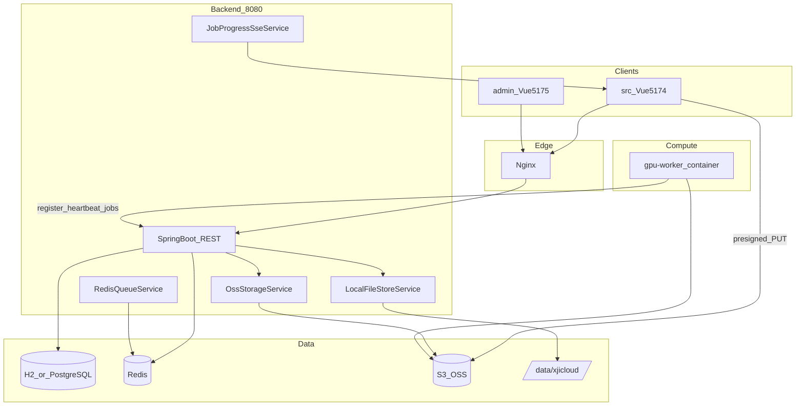

# XJICloud — Agent 上下文记忆文档

> 供 Cursor / 其他 AI Agent 快速理解本仓库的结构、已实现功能、扩展点与约束。  
> 用户面向文档见 [README.md](README.md)；部署见 [Deploy.md](Deploy.md)。

**最后更新：** 2026-06-21（云平台扩展：OSS + Redis 队列 + GPU Worker + Admin 面板）

---

## 1. 项目是什么

**XJICloud** 是一套 **3D Gaussian Splatting（3DGS）建模解决方案云平台**：

- 用户通过 Web 上传图片数据集 → 触发 GPU 算力容器训练（当前为 **mock 算法**）→ 下载产出模型（PLY）
- 用户上传 / 管理 **PLY/SPZ** 模型，用 **Spark 2.0** 查看标注，用 **SuperSplat** iframe 做高级编辑
- 管理员通过独立 **Vue Admin 面板** 配置 OSS、监控 Worker 与训练任务

技术栈：**Vue 3.5 + Vite + Pinia**（用户前端）、**Spring Boot 3.3 + Java 17**（后端）、**Redis**（任务队列）、**S3 兼容 OSS**（MinIO / 阿里云 OSS）、**Python GPU Worker 容器**（Alibaba Cloud Linux 3）。

另有 **Electron 桌面版**（本地打开模型，不依赖云后端）和 **Rust/WASM** 渲染核心（浏览器端 Spark，非服务端 GPU）。

---

## 2. 仓库结构（Monorepo）

```
XJICloud/
├── src/                      # 用户 Vue 前端（端口 5174）
├── admin/                    # 管理 Vue 前端（端口 5175，base /admin/）
├── backend/                  # Spring Boot 单体后端（端口 8080）
├── gpu-worker/               # GPU 算力容器 Python Agent + Dockerfile
├── deploy/                   # docker-compose、nginx、systemd、env 模板
├── electron/                 # 桌面壳
├── rust/                     # spark-rs、spark-worker-rs WASM 构建
├── src/lib/spark/            # Spark 2.0 渲染 TS 库（Proprietary 许可）
├── modules/supersplat/       # SuperSplat 子工程（⚠ 仓库中可能未 checkout）
├── public/supersplat/        # SuperSplat 构建产物（gitignore）
├── Deploy.md                 # 全栈 Linux 部署指南
├── README.md                 # 用户文档（部分内容未同步新架构，以本文为准）
└── AGENT_CONTEXT.md          # 本文件
```

---

## 3. 系统架构



### 3.1 双存储策略（重要）

| 数据类型 | 存储 | 服务类 |
|----------|------|--------|
| PLY/SPZ 模型、viewer.json | **本地磁盘** `{xjicloud.storage.root}` | `LocalFileStoreService` |
| 图片数据集、训练产出 model.ply | **OSS**（浏览器/Worker 直传） | `OssStorageService` |
| 元数据（用户、项目、任务、Worker） | **H2（dev）/ PostgreSQL（prod）** | JPA 实体 |

**不要**在未规划的情况下把 PLY/SPZ 模型迁移到 OSS，会破坏 Spark/SuperSplat 现有下载/Range 逻辑。

### 3.2 三套 JWT 身份

| 角色 | claim `type` | Filter | 用途 |
|------|--------------|--------|------|
| 用户 | `user` | `JwtAuthenticationFilter` | 普通云平台 API |
| 管理员 | `admin` | `AdminJwtAuthenticationFilter` | `/api/v1/admin/**` |
| Worker | `worker` | `WorkerJwtAuthenticationFilter` | `/api/v1/worker/**`（register 除外） |

Worker 注册额外需要请求头：`X-Worker-Secret`，与 `xjicloud.worker.shared-secret` 一致。

---

## 4. 训练流水线（图片 → 模型）

```
1. 用户选择文件夹（webkitdirectory）
   → src/utils/datasetArchive.ts 过滤 jpg/png/webp，重命名为 0001.jpg…
   → 生成 manifest.json

2. POST /api/v1/projects/{id}/datasets
   → 后端创建 TrainingJob(status=UPLOADING)，返回 presigned PUT URL 列表

3. 浏览器直传 OSS（src/api/datasets.ts putToOss，XHR 进度）

4. POST /api/v1/projects/{id}/datasets/{jobId}/complete
   → status=QUEUED，写入 Redis 队列 xjicloud:jobs

5. gpu-worker poll GET /api/v1/worker/jobs/next
   → 下载图片 → mock_trainer.py 分阶段上报进度
   → PUT output.ply 至 OSS → POST .../complete

6. 用户 GET /api/v1/jobs/{id}/events（SSE）实时看进度
   → COMPLETED 后 GET /api/v1/jobs/{id} 拿 presigned 下载 URL
```

**Job 状态枚举：** `PENDING | UPLOADING | QUEUED | RUNNING | COMPLETED | FAILED | CANCELLED`

---

## 5. 后端包结构（`com.xjicloud.*`）

| 包 | 职责 |
|----|------|
| `auth/` | 用户注册登录、JWT |
| `project/` | 工程项目 CRUD |
| `model/` | PLY/SPZ 本地上传下载、viewer-config、export |
| `job/` | 训练任务、数据集 API、`TrainingJobService` |
| `worker/` | Worker 节点注册、心跳、领任务、进度 |
| `admin/` | 管理员账户、Admin API |
| `oss/` | S3 兼容存储、presigned URL、DB 热更新配置 |
| `queue/` | Redis 列表队列 |
| `sse/` | `JobProgressSseService`（SseEmitter） |
| `config/` | Security、Redis、各 Properties |

**入口：** `backend/src/main/java/com/xjicloud/XjiCloudApplication.java`（`@EnableScheduling`）

**配置：** `backend/src/main/resources/application.yml`  
关键前缀：`xjicloud.jwt` / `storage` / `oss` / `worker` / `admin` / `cors`

**OSS 运行时配置：** 默认读 yml，管理员可通过 Admin API 写入 `system_config` 表并 `reloadClients()`。

---

## 6. REST API 速查

前缀 `/api/v1`。统一响应：`{ success, message, data }`。

### 6.1 用户（Bearer 用户 JWT）

| 方法 | 路径 | 说明 |
|------|------|------|
| POST | `/auth/register`, `/auth/login` | 公开 |
| GET/POST | `/projects` | 项目 |
| GET | `/projects/{id}/models` | 模型列表 |
| POST | `/projects/{id}/models/upload` | multipart PLY/SPZ → 本地盘 |
| POST | `/models/{id}/download-token` | SuperSplat 短期下载 token |
| GET | `/models/{id}/download` | 下载（Bearer 或 `?access_token=`，支持 Range） |
| GET/PUT | `/models/{id}/viewer-config` | 查看器 JSON v2 |
| POST | `/models/{id}/export` | 上传导出 SPZ/PLY |
| POST | `/projects/{id}/datasets` | 创建数据集任务 + presigned URLs |
| POST | `/projects/{id}/datasets/{jobId}/complete` | 确认上传完成并入队 |
| GET | `/projects/{id}/jobs` | 项目训练任务列表 |
| GET | `/jobs/{id}` | 任务详情 |
| GET | `/jobs/{id}/events` | **SSE** 进度（需 Authorization，前端用 fetch 流式读） |

### 6.2 Worker（Bearer worker JWT + 注册时 X-Worker-Secret）

| 方法 | 路径 |
|------|------|
| POST | `/worker/register` |
| POST | `/worker/heartbeat` |
| GET | `/worker/jobs/next` | 长轮询（默认 25s） |
| POST | `/worker/jobs/{id}/progress` |
| POST | `/worker/jobs/{id}/complete` |
| POST | `/worker/jobs/{id}/fail` |

### 6.3 Admin（Bearer admin JWT）

| 方法 | 路径 |
|------|------|
| POST | `/admin/auth/login` | 公开 |
| GET | `/admin/dashboard` |
| GET/PUT | `/admin/oss` |
| POST | `/admin/oss/test` |
| GET | `/admin/workers` |
| POST | `/admin/workers/{id}/offline` |
| GET | `/admin/jobs` |
| POST | `/admin/jobs/{id}/retry`, `/cancel` |
| GET | `/admin/stats` |

**默认管理员：** `admin` / `admin123`（`AdminDataInitializer` 首次启动创建，生产必改）

---

## 7. 用户前端（`src/`）

### 7.1 路由

| 路径 | 组件 | 说明 |
|------|------|------|
| `/login` | `LoginView.vue` | |
| `/app/home` | `HomeView.vue` | 新建/打开项目 |
| `/app/projects` | `ProjectListView.vue` | 工程列表 + 模型上传 |
| `/app/upload` | `UploadView.vue` | Tab：图片数据集 / 模型文件 |
| `/app/layer` | `LayerViewerView.vue` | Spark 查看器（`main.css` 绿色主题） |
| `/app/supersplat` | `SuperSplatEditorView.vue` | iframe 高级编辑 |

**壳层：** `layouts/CloudLayout.vue`（`cloud.css` 蓝色主题）

### 7.2 训练相关前端文件

| 文件 | 作用 |
|------|------|
| `utils/datasetArchive.ts` | 文件夹归档、manifest |
| `api/datasets.ts` | 数据集/任务 API、OSS PUT、SSE 订阅 |
| `stores/trainingJob.ts` | Pinia 任务列表 + SSE |
| `components/DatasetUploadPanel.vue` | 文件夹选择与上传 UI |
| `components/TrainingJobPanel.vue` | 任务进度与下载 |
| `components/FileUploadButton.vue` | 复用 PLY/SPZ 上传 |
| `components/ToolIcon.vue` | 侧栏 SVG 图标 |

### 7.3 UI 约定

- 云平台页面用 **`.cloud-btn` / `.cloud-card` / `.cloud-progress-*`**（`styles/cloud.css`）
- 查看器页保留 **`.side-button`** 等（`styles/main.css`，绿色 `#10b981`）
- **无** Element Plus / Tailwind；纯 CSS class 约定

### 7.4 仍为占位（`showComingSoon` alert）

`CloudLayout.vue` 顶栏：搜索索引、双屏显示、用户空间、热力展示；侧栏：航线规划。

---

## 8. 管理面板（`admin/`）

- 独立 Vite 工程，`base: '/admin/'`，开发端口 **5175**
- API 客户端：`admin/src/api/adminClient.ts`
- Token：`localStorage xjicloud_admin_token`
- 页面：Dashboard、OSS 配置、Workers、Jobs

构建：`npm run build:admin` 或根目录 `npm run build:all:cloud`

---

## 9. GPU Worker（`gpu-worker/`）

| 文件 | 说明 |
|------|------|
| `Dockerfile` | `FROM alibaba-cloud-linux-3-registry.cn-hangzhou.cr.aliyuncs.com/alinux3/alinux3:latest` |
| `worker_agent.py` | 注册、心跳、poll、调度训练 |
| `mock_trainer.py` | **可替换为真实算法**；当前生成占位 PLY |
| `oss_client.py` | presigned URL 下载/上传 |
| `entrypoint.sh` | 启动入口 |

环境变量：`XJICLOUD_BACKEND_URL`、`WORKER_SECRET`、`WORKER_NAME`、可选 OSS 凭证。

---

## 10. 部署与本地开发

**推荐生产拓扑（分机）：**

| 服务器 | 角色 | 预生产 | 生产 |
|--------|------|--------|------|
| A | 前端 Nginx + dist/admin | 同 | 同 |
| B | Spring Boot + PG + Redis | 同 | RDS/云 Redis 可选 |
| C | MinIO | MinIO | **阿里云 OSS**（不部署 C） |
| D | GPU Worker Docker | 常驻容器 | **阿里云 CCI** 按需启动 |

前端 A 的 Nginx 将 `/api/` 反代到后端 B；浏览器直传 OSS（C 或阿里云）；Worker/D/CCI 仅连 B + presigned URL。

| 文档/文件 | 用途 |
|-----------|------|
| [Deploy.md](Deploy.md) | **分机部署**、安全组、MinIO/OSS、CCI 按需启停 |
| [deploy/nginx-frontend.conf.example](deploy/nginx-frontend.conf.example) | 前端 A → 后端 B 反代 |
| [deploy/deploy-backend.sh](deploy/deploy-backend.sh) | 后端 B 一键构建 + systemd |
| [deploy/config/](deploy/config/) | 用户自备 `application-prod.yml` 等 |
| [deploy/docker-compose.yml](deploy/docker-compose.yml) | 单机/开发 Compose |

**本地最小依赖：** Redis + MinIO（`cd deploy && docker compose up redis minio minio-init -d`）

**开发启动：**

```bash
# 后端
cd backend && mvn spring-boot:run

# 用户前端
npm run dev          # :5174，/api 代理到 8080

# 管理面板
cd admin && npm run dev   # :5175

# Worker
docker build -t xjicloud/gpu-worker gpu-worker/
docker run --rm -e XJICLOUD_BACKEND_URL=http://host.docker.internal:8080 \
  -e WORKER_SECRET=change-me-worker-secret-in-production xjicloud/gpu-worker
```

---

## 11. 已知限制与陷阱

1. **SuperSplat 子模块：** `modules/supersplat/` 可能不在仓库中；需自行 clone playcanvas/supersplat 并 `npm run build:supersplat`。
2. **浏览器文件夹上传：** 依赖 `webkitdirectory`；Safari 支持弱。
3. **OSS CORS：** 浏览器直传前必须在 bucket 配置 CORS（Deploy.md §5.3）。
4. **SSE + Nginx：** 需 `proxy_buffering off`。
5. **Worker 密钥：** 后端 `xjicloud.worker.shared-secret` 与容器 `WORKER_SECRET` 必须一致。
6. **训练算法：** 仅为通讯骨架 + mock；真实 3DGS 训练需替换 `mock_trainer.py`。
7. **README.md** 架构图仍描述「仅本地磁盘」，未完全反映 OSS/Redis/Worker；以 **本文 + Deploy.md** 为准。
8. **backend/tests：** 暂无自动化测试。
9. **Windows 开发：** 路径可用；生产部署按 Linux 约定。

---

## 12. Agent 修改指南

### 应遵循的约定

- **最小 diff**：不要无关重构；Viewer 与 Cloud 样式体系保持分离。
- **不修改** `src/lib/spark/`、`rust/` 下 Spark 专有代码，除非任务明确涉及渲染。
- **不修改** 计划文件（`.cursor/plans/*.plan.md`），除非用户要求。
- **Commit/PR：** 仅用户明确要求时执行；默认不提交。
- 新云平台 UI 用 `cloud.css` token；新后端 API 走 `ApiResponse` + `BusinessException` 模式。

### 常见扩展点

| 需求 | 建议入口 |
|------|----------|
| 替换真实训练算法 | `gpu-worker/mock_trainer.py` → 新 `trainer.py` |
| 训练完成后自动入库为可查看模型 | `TrainingJobService.markCompleted` 后调用 `ModelService` |
| 新 Admin 功能 | `admin/` 视图 + `AdminController` |
| 新用户侧云功能 | `src/views` + `src/api` + 后端 controller |
| OSS 切换供应商 | Admin OSS 页或 `OssStorageService`（S3 兼容） |
| 统一存储抽象 | 新建 `StorageBackend` 接口，逐步迁移 `LocalFileStoreService` |

### 关键配置文件

```
backend/src/main/resources/application.yml
backend/pom.xml
vite.config.ts              # 用户前端 dev proxy /api → 8080
admin/vite.config.ts          # base /admin/
deploy/application-prod.yml.example
```

---

## 13. 实体与 Redis 键

**JPA 表：** `users`, `projects`, `model_assets`, `viewer_configs`, `training_jobs`, `dataset_assets`, `worker_nodes`, `admin_users`, `system_config`

**Redis：** 列表键 `xjicloud:jobs`（LPUSH 入队 / BLPOP 出队）

**OSS 路径约定：**

- 数据集：`datasets/{jobId}/images/0001.jpg`，`datasets/{jobId}/manifest.json`
- 产出：`outputs/{jobId}/model.ply`

---

## 14. 相关历史

2026-06 完成「云平台完善」计划，新增：OSS、Redis 任务队列、GPU Worker 通讯骨架、图片文件夹训练流、Admin 面板、Deploy.md。  
原计划文件：`.cursor/plans/xjicloud_platform_expansion_846a3b69.plan.md`（勿编辑）。

---

*本文档由 Agent 生成，请在重大架构变更后同步更新。*
