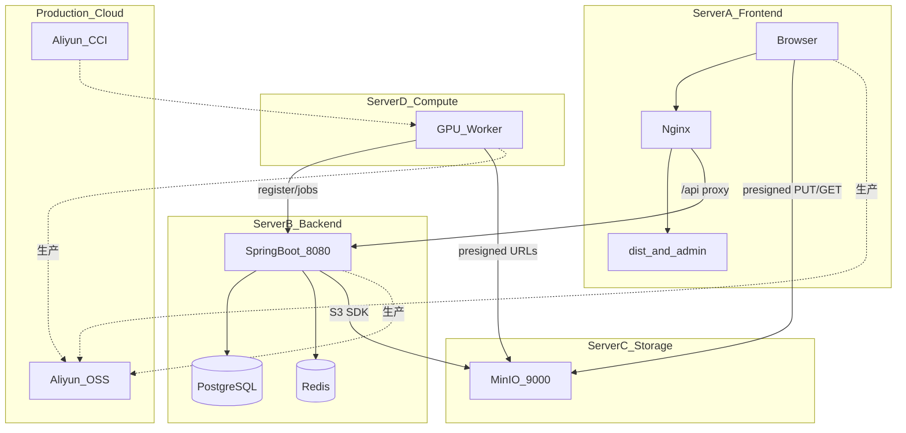

# XJICloud 云平台部署指南

本文档说明如何在 **Linux（Ubuntu / CentOS / Alibaba Cloud Linux）** 上部署 XJICloud。

**推荐生产拓扑：** 前端、后端、对象存储、算力容器分机部署；生产环境对象存储使用 **阿里云 OSS**，算力使用 **阿里云 CCI 弹性容器实例**（按需启动）。预生产/自建环境可用 **MinIO + 自建 GPU 服务器** 替代。

---

## 1. 架构概览

### 1.1 分机部署（推荐）



| 服务器 | 角色 | 组件 | 生产替代 |
|--------|------|------|----------|
| **A — 前端** | 静态站点 + 反向代理 | Nginx、`dist/`、`admin/dist/` | 可叠加 CDN |
| **B — 后端** | 业务 API | Spring Boot JAR、PostgreSQL、Redis | RDS、云 Redis（可选） |
| **C — 存储** | 对象存储 | **MinIO**（S3 兼容） | **阿里云 OSS** |
| **D — 算力** | 训练 Worker | **Docker GPU 容器** | **阿里云 CCI**（按需启动） |

> **说明：** PLY/SPZ 模型文件仍存后端服务器 B 本地磁盘（`xjicloud.storage.root`）；图片数据集与训练产出走 OSS（C 或阿里云 OSS）。

### 1.2 流量与连接关系

| 来源 | 目标 | 端口/协议 | 用途 |
|------|------|-----------|------|
| 用户浏览器 | 服务器 A | 443 HTTPS | 访问前端页面 |
| 用户浏览器 | 服务器 A `/api/` | 443 → 代理到 B:8080 | REST、SSE 进度 |
| 用户浏览器 | 服务器 C / 阿里云 OSS | 9000 或 HTTPS | **浏览器直传**图片（presigned URL） |
| 服务器 B | 服务器 C / 阿里云 OSS | S3 API | 签发 presigned URL、管理配置 |
| 服务器 B | PostgreSQL / Redis | 5432 / 6379 | 元数据与任务队列 |
| 服务器 D / CCI | 服务器 B | 8080 HTTP(S) | Worker 注册、心跳、领任务 |
| 服务器 D / CCI | OSS | HTTPS | 通过 presigned URL 下载图片、上传模型 |

### 1.3 预生产 vs 生产对照

| 项目 | 预生产（自建分机） | 生产（阿里云） |
|------|-------------------|--------------|
| 对象存储 | 服务器 C：MinIO | 阿里云 OSS（不再部署 MinIO） |
| OSS endpoint | `http://10.0.1.30:9000`，`path-style-access: true` | `https://oss-cn-*.aliyuncs.com`，`path-style-access: false` |
| 算力 | 服务器 D：常驻 Docker Worker | **CCI 弹性容器实例**，有任务时启动 |
| 数据库 | 服务器 B 本机 PostgreSQL | 推荐 **RDS PostgreSQL** |
| 缓存 | 服务器 B 本机 Redis | 可选 **云 Redis** |
| 前端 | 服务器 A + 域名 + HTTPS | 同左，建议 WAF/CDN |

---

## 2. 环境要求

| 组件 | 版本 | 部署位置 |
|------|------|----------|
| 操作系统 | Ubuntu 22.04+ / CentOS 7+ / Alibaba Cloud Linux 3 | 各服务器 |
| Java | 17+ | 服务器 B |
| Maven | 3.9+ | 构建机（可非生产机） |
| Node.js | ≥ 18（SuperSplat ≥ 20.19） | 构建机 |
| Nginx | 1.18+ | 服务器 A |
| PostgreSQL | 14+ | 服务器 B 或 RDS |
| Redis | 7+ | 服务器 B 或云 Redis |
| Docker | 24+ | 服务器 C（MinIO）、D（Worker） |
| NVIDIA Container Toolkit | 最新 | 服务器 D（GPU 时） |

---

## 3. 网络与安全组规划

以下为 **最小放通** 建议（优先使用**内网/VPC 互通**，公网仅开放必要入口）。

### 3.1 服务器 A（前端）

| 方向 | 端口 | 来源 | 说明 |
|------|------|------|------|
| 入站 | 443 | 0.0.0.0/0 | HTTPS 用户访问 |
| 入站 | 80 | 0.0.0.0/0 | 可选，跳转 HTTPS |
| 出站 | 8080 | 服务器 B 内网 IP | Nginx 反代 `/api/` |

### 3.2 服务器 B（后端）

| 方向 | 端口 | 来源 | 说明 |
|------|------|------|------|
| 入站 | 8080 | 服务器 A 内网 IP | API（勿对公网裸奔，或经 SLB + 白名单） |
| 入站 | 8080 | 服务器 D / CCI 网段 | Worker 注册与心跳 |
| 入站 | 5432 | 本机或 RDS 安全组 | PostgreSQL |
| 入站 | 6379 | 本机 | Redis |
| 出站 | 9000 或 443 | 服务器 C / 阿里云 OSS | S3 协议 |

**`xjicloud.cors.allowed-origins`：** 填服务器 A 的 **前端域名**（如 `https://cloud.example.com`），**不是**后端地址。

### 3.3 服务器 C（MinIO，预生产）

| 方向 | 端口 | 来源 | 说明 |
|------|------|------|------|
| 入站 | 9000 | 服务器 B 内网 IP | 后端 S3 SDK |
| 入站 | 9000 | 用户浏览器公网 IP 段 | **CORS 直传**（或通过 OSS 公网 endpoint） |
| 入站 | 9001 | 运维 IP | MinIO 控制台（可选，勿公开） |

### 3.4 服务器 D（GPU Worker，预生产）

| 方向 | 端口 | 来源 | 说明 |
|------|------|------|------|
| 出站 | 8080 | 服务器 B | 连接后端 |
| 出站 | 9000 或 443 | 服务器 C / OSS | presigned 下载/上传 |

---

## 4. 构建（在构建机或各服务器上执行）

```bash
git clone https://github.com/XJI1234/XJICloud.git
cd XJICloud
```

### 4.1 用户前端 + 管理面板

```bash
npm ci
npm run build:supersplat   # 可选，需 modules/supersplat 源码
npm run build
npm run build:admin
# 产物：dist/ 、admin/dist/
# 或：npm run build:all:cloud
```

### 4.2 后端

```bash
cd backend && mvn -DskipTests package
# 产物：backend/target/xjicloud-backend-1.0.0.jar
```

### 4.3 GPU Worker 镜像

```bash
docker build -t xjicloud/gpu-worker:latest gpu-worker/
# 生产：推送到阿里云 ACR，供 CCI 拉取
# docker tag xjicloud/gpu-worker:latest registry.cn-hangzhou.aliyuncs.com/your-ns/xjicloud-gpu-worker:latest
# docker push registry.cn-hangzhou.aliyuncs.com/your-ns/xjicloud-gpu-worker:latest
```

---

## 5. 分机部署步骤

以下 IP 为示例，请替换为实际内网地址：

| 角色 | 示例 IP | 域名 |
|------|---------|------|
| A 前端 | — | `https://cloud.example.com` |
| B 后端 | `10.0.1.20` | `api-internal.example.com`（可选内网 DNS） |
| C MinIO | `10.0.1.30` | — |
| D GPU | `10.0.1.40` | — |

---

### 5.1 服务器 C — MinIO（预生产专用）

生产环境**跳过本节**，直接使用 [§5.5 阿里云 OSS](#55-生产环境--阿里云-oss)。

```bash
# 在服务器 C 上
docker run -d --name minio --restart unless-stopped \
  -p 9000:9000 -p 9001:9001 \
  -e MINIO_ROOT_USER=minioadmin \
  -e MINIO_ROOT_PASSWORD='强密码' \
  -v /data/minio:/data \
  minio/minio server /data --console-address ":9001"

# 创建 bucket
docker run --rm --network host minio/mc alias set local http://127.0.0.1:9000 minioadmin '强密码'
docker run --rm --network host minio/mc mb local/xjicloud
```

**CORS（浏览器从服务器 A 域名直传）：**

```bash
cat > /tmp/cors.json <<'EOF'
[
  {
    "AllowedOrigin": ["https://cloud.example.com"],
    "AllowedMethod": ["GET", "PUT", "HEAD"],
    "AllowedHeader": ["*"],
    "ExposeHeader": ["ETag"],
    "MaxAgeSeconds": 3600
  }
]
EOF
docker run --rm -v /tmp/cors.json:/cors.json --network host minio/mc \
  anonymous set-json /tmp/cors.json local/xjicloud
```

---

### 5.2 服务器 B — 后端

#### 依赖：PostgreSQL + Redis

可与 JAR 同机安装；生产推荐 **RDS + 云 Redis**，在 `application-prod.yml` 中填**内网地址**。

```bash
# PostgreSQL（同机示例）
sudo -u postgres psql <<'SQL'
CREATE USER xjicloud WITH PASSWORD 'your-password';
CREATE DATABASE xjicloud OWNER xjicloud;
SQL

# Redis（同机示例）
sudo systemctl enable --now redis
```

#### 配置

```bash
cp deploy/config/application-prod.yml.example deploy/config/application-prod.yml
vim deploy/config/application-prod.yml
```

**分机关键项：**

```yaml
xjicloud:
  cors:
    allowed-origins: https://cloud.example.com    # 服务器 A 的前端域名
  oss:
    endpoint: http://10.0.1.30:9000               # 服务器 C MinIO 内网地址
    path-style-access: true
    bucket: xjicloud
    access-key: minioadmin
    secret-key: 强密码
  worker:
    shared-secret: 与 Worker/CCI 环境变量一致的密钥
```

#### 一键部署

```bash
chmod +x deploy/deploy-backend.sh
sudo ./deploy/deploy-backend.sh
```

验证（在服务器 B 或 A 上）：

```bash
curl http://10.0.1.20:8080/actuator/health
```

详见 [`deploy/config/README.md`](config/README.md)、[`deploy/deploy-backend.sh`](deploy/deploy-backend.sh)。

---

### 5.3 服务器 A — 前端

仅部署静态资源；**`/api/` 反向代理到服务器 B**（用户浏览器仍访问同源 `/api`，无需改前端 `VITE_API_BASE_URL`）。

```bash
sudo mkdir -p /var/www/xjicloud
sudo cp -r dist /var/www/xjicloud/
sudo cp -r admin/dist /var/www/xjicloud/admin/

# 使用「分机版」Nginx 配置
sudo cp deploy/nginx-frontend.conf.example /etc/nginx/conf.d/xjicloud.conf
sudo vim /etc/nginx/conf.d/xjicloud.conf
# 修改：server_name、proxy_pass http://10.0.1.20:8080

sudo nginx -t && sudo systemctl reload nginx
```

HTTPS：

```bash
sudo apt install certbot python3-certbot-nginx
sudo certbot --nginx -d cloud.example.com
```

**访问地址：**

- 用户前端：`https://cloud.example.com/`
- 管理面板：`https://cloud.example.com/admin/`

---

### 5.4 服务器 D — GPU Worker（预生产）

```bash
# 在服务器 D 上，已安装 Docker + NVIDIA Container Toolkit（可选）
docker run -d --name xjicloud-worker --restart unless-stopped \
  --gpus all \
  -e XJICLOUD_BACKEND_URL=http://10.0.1.20:8080 \
  -e WORKER_SECRET='与后端 xjicloud.worker.shared-secret 一致' \
  -e WORKER_NAME=gpu-worker-1 \
  xjicloud/gpu-worker:latest
```

Worker 通过后端下发的 **presigned URL** 访问 OSS，通常**无需**在 Worker 上单独配置 OSS 凭证（除非改为直连 SDK）。

启动流程：等待 B `/actuator/health` → 注册 → 心跳 → 长轮询领任务 → mock 训练 → 回传模型。

---

### 5.5 生产环境 — 阿里云 OSS

生产**不再部署服务器 C（MinIO）**，在后端配置（或管理面板 **OSS 设置**）中改为：

```yaml
xjicloud:
  oss:
    endpoint: https://oss-cn-hangzhou.aliyuncs.com   # 与 Bucket 地域一致
    region: cn-hangzhou
    bucket: your-production-bucket
    access-key: RAM 子账号 AccessKey
    secret-key: RAM 子账号 SecretKey
    path-style-access: false
    presign-expiration-minutes: 120
```

**控制台配置：**

1. 创建 Bucket（建议私有读写）
2. **跨域 CORS**：来源 `https://cloud.example.com`，方法 `GET/PUT/HEAD`，Headers `*`
3. RAM 用户授予该 Bucket 的读写权限（`AliyunOSSFullAccess` 或自定义最小权限）
4. 服务器 B 安全组允许 **出站 443** 访问 `*.aliyuncs.com`

**验证：** 管理面板 → OSS 配置 → **测试连接**。

---

### 5.6 生产环境 — 阿里云 CCI 弹性容器实例

预生产服务器 D 的 Docker Worker，在生产替换为 **CCI**：有训练任务时启动实例，空闲时可停止以节省成本。

#### 5.6.1 准备镜像（ACR）

```bash
# 构建机
docker build -t xjicloud/gpu-worker:latest gpu-worker/
docker tag xjicloud/gpu-worker:latest \
  registry.cn-hangzhou.aliyuncs.com/YOUR_NAMESPACE/xjicloud-gpu-worker:latest
docker push registry.cn-hangzhou.aliyuncs.com/YOUR_NAMESPACE/xjicloud-gpu-worker:latest
```

#### 5.6.2 创建 CCI 实例（控制台要点）

| 配置项 | 建议值 |
|--------|--------|
| 镜像 | ACR 中 `xjicloud-gpu-worker:latest` |
| 规格 | 按 GPU 需求选择（如 GPU 计算型） |
| 网络 | 与**服务器 B 同一 VPC**，分配私网 IP |
| 重启策略 | 按需；任务结束后可手动/脚本停止实例 |

**环境变量（必填）：**

| 变量 | 示例 | 说明 |
|------|------|------|
| `XJICLOUD_BACKEND_URL` | `http://10.0.1.20:8080` | 后端**内网**地址（推荐） |
| `WORKER_SECRET` | 与后端一致 | Worker 注册密钥 |
| `WORKER_NAME` | `cci-worker-01` | 管理面板中显示的名称 |

> Worker 使用后端 API 返回的 presigned URL 读写 OSS，**生产一般无需**在 CCI 中配置 OSS AccessKey。

#### 5.6.3 按需启停

| 场景 | 操作 |
|------|------|
| 有训练任务、队列积压 | 启动 1~N 个 CCI 实例 |
| 队列清空、无 RUNNING 任务 | 停止 CCI 实例 |
| 自动扩缩（进阶） | 可通过阿里云函数计算 / 运维脚本监听 Admin 面板队列深度或 Redis `LLEN xjicloud:jobs` 触发 CCI API |

**安全组：** CCI 所在安全组需 **出站** 访问 B:8080；B 的安全组需 **入站** 允许 CCI 网段访问 8080。

#### 5.6.4 使用 CLI 启动示例（可选）

```bash
# 需安装 aliyun CLI 并配置凭证；参数以当前 CCI API 文档为准
# aliyun cci CreateContainerGroup --ContainerGroupName xjicloud-worker-1 ...
```

具体 API 字段随阿里云产品更新，请以 [容器计算服务 CCI 文档](https://help.aliyun.com/product/97658.html) 为准。

---

## 6. 配置检查清单（分机 + 生产）

| 检查项 | 位置 | 预期 |
|--------|------|------|
| 前端 `/api/` 代理 | 服务器 A Nginx | `proxy_pass` 指向 B:8080 |
| CORS | 服务器 B `application-prod.yml` | 含 `https://cloud.example.com` |
| OSS CORS | MinIO / 阿里云 Bucket | 允许前端域名 PUT/GET |
| OSS endpoint | 服务器 B | 预生产：`http://C:9000`；生产：阿里云 OSS HTTPS |
| Worker 密钥 | B 与 D/CCI | `worker.shared-secret` = `WORKER_SECRET` |
| Worker 可达后端 | D/CCI → B | `curl http://10.0.1.20:8080/actuator/health` |
| SSE | 服务器 A Nginx | `proxy_buffering off` |
| 浏览器直传 | 用户 → OSS | 开发者工具 Network 中 PUT 指向 C 或 `*.aliyuncs.com` |

---

## 7. 单机 / 开发环境（可选）

本地或单机演示仍可使用 Docker Compose（Redis + MinIO + Backend + Worker 同机）：

```bash
cd deploy && docker compose up -d --build
npm run dev          # 用户前端 :5174
cd admin && npm run dev   # 管理面板 :5175
```

单机 Nginx（前后端同机）使用 [`deploy/nginx.conf.example`](nginx.conf.example)（`/api/` → `127.0.0.1:8080`）。

---

## 8. 管理控制面板

- 地址：`https://cloud.example.com/admin/`（部署在服务器 A）
- 默认账号：`admin` / `admin123`（**生产务必修改**）
- 可在面板中修改 OSS 配置（生产切到阿里云 OSS 时尤其方便），支持连接测试、Worker 与任务监控

---

## 9. 验收清单

- [ ] 用户通过 **服务器 A 域名** 注册/登录
- [ ] 图片文件夹上传：浏览器直传 **MinIO/OSS** 成功（Network 可见 PUT）
- [ ] 训练任务入队；**服务器 D 或 CCI** 上 Worker 在管理面板显示 ONLINE
- [ ] SSE 训练进度正常刷新
- [ ] 完成后可下载 `model.ply`
- [ ] PLY/SPZ 模型上传与 Spark 查看器正常（文件在 **服务器 B** 本地盘）
- [ ] 生产：OSS 为阿里云、CCI 可按需启动并完成一次完整训练

---

## 10. 故障排查

| 现象 | 可能原因 | 处理 |
|------|----------|------|
| 前端 502 / API 失败 | A 无法访问 B:8080 | 检查 Nginx `proxy_pass`、B 安全组 |
| CORS 错误 | B 未配置 A 的域名 | 修改 `xjicloud.cors.allowed-origins` |
| OSS PUT 失败 | Bucket CORS 或 endpoint 错误 | MinIO/OSS 跨域；presigned URL 域名需浏览器可达 |
| 任务一直 QUEUED | Worker/CCI 未运行 | 启动 D 或 CCI；检查 `WORKER_SECRET` |
| Worker OFFLINE | 心跳超时 | B 防火墙；`XJICLOUD_BACKEND_URL` 是否用内网地址 |
| CCI 无法注册 | VPC 不通或 URL 错误 | CCI 与 B 同 VPC；健康检查 `/actuator/health` |
| SSE 无进度 | Nginx 缓冲 | A 上 `proxy_buffering off` |
| 生产 OSS 失败 | RAM 权限 / endpoint 地域 | 管理面板测试连接；核对 `path-style-access: false` |

---

## 11. 相关文件

| 文件 | 说明 |
|------|------|
| [`deploy/nginx-frontend.conf.example`](nginx-frontend.conf.example) | **分机**：前端 A，API 代理到后端 B |
| [`deploy/nginx.conf.example`](nginx.conf.example) | **同机**：前后端同一 Nginx |
| [`deploy/deploy-backend.sh`](deploy-backend.sh) | 后端 B 一键构建 + systemd |
| [`deploy/config/application-prod.yml.example`](config/application-prod.yml.example) | 含 MinIO / 阿里云 OSS 注释模板 |
| [`deploy/config/README.md`](config/README.md) | 后端配置说明 |
| [`deploy/docker-compose.yml`](docker-compose.yml) | 单机/开发 Compose |
| [`deploy/env.example`](env.example) | Compose 环境变量 |
| [`gpu-worker/Dockerfile`](../gpu-worker/Dockerfile) | Worker 镜像（预生产 D / 生产 CCI） |
| [`AGENT_CONTEXT.md`](../AGENT_CONTEXT.md) | Agent 项目上下文 |
