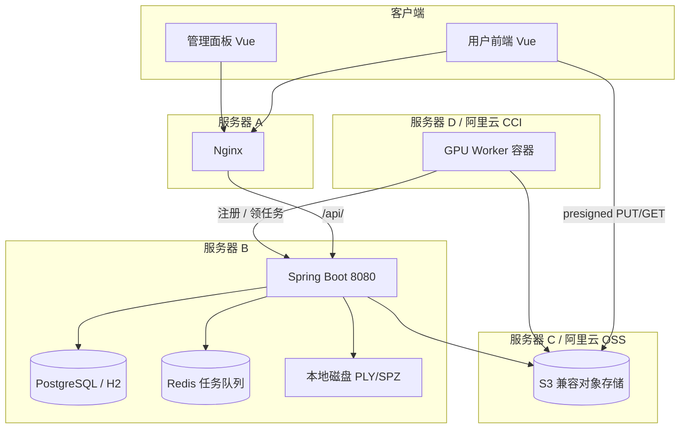

# XJICloud

3D Gaussian Splatting（3DGS）建模云平台：用户上传图片数据集触发 GPU 训练、管理 PLY/SPZ 模型，并在浏览器中用 Spark 2.0 查看、SuperSplat 高级编辑。

---

## 功能概览

### 用户端（`src/`，端口 5174）

| 能力 | 说明 |
|------|------|
| 账户与工程 | 注册/登录，创建与管理工程项目 |
| 图片数据集训练 | 选择本地文件夹（`webkitdirectory`），浏览器 **presigned URL 直传 OSS**，SSE 实时进度，完成后下载产出 PLY |
| 模型上传 | PLY/SPZ 上传至后端本地磁盘，支持 Range 下载 |
| Spark 查看器 | 基于 Spark 2.0 + Rust/WASM 的 Web 标注查看（`/app/layer`） |
| SuperSplat 编辑 | iframe 嵌入高级编辑（需单独构建 SuperSplat） |

### 管理端（`admin/`，端口 5175，路径 `/admin/`）

| 能力 | 说明 |
|------|------|
| 仪表盘 | 任务与 Worker 概览 |
| OSS 配置 | 在线修改 S3 兼容存储 endpoint/凭证，连接测试 |
| Worker 监控 | 节点在线状态、强制下线 |
| 任务管理 | 训练任务列表、重试、取消 |

默认管理员：`admin` / `admin123`（首次启动创建，**生产环境务必修改**）。

### GPU Worker（`gpu-worker/`）

Python 容器 Agent：向后端注册、心跳、从 Redis 队列领取任务，通过 presigned URL 下载数据集、上传产出。当前训练逻辑为 **mock 占位**（`mock_trainer.py`），可替换为真实 3DGS 算法。

### 桌面版（可选）

Electron 壳（`electron/`）可本地打开模型，不依赖云后端。构建：`npm run electron:build`。

---

## 系统架构



### 双存储策略

| 数据 | 存储位置 | 访问方式 |
|------|----------|----------|
| 图片数据集、训练产出 `model.ply` | **OSS**（MinIO / 阿里云 OSS） | 浏览器与 Worker **presigned URL 直传** |
| 用户上传的 PLY/SPZ、viewer 配置 | **后端本地磁盘** `xjicloud.storage.root` | REST API + Range 下载 |
| 用户、项目、任务、Worker 元数据 | **H2（开发）/ PostgreSQL（生产）** | JPA |

### 训练流水线

```
1. 用户选择图片文件夹 → 前端归档为 0001.jpg… + manifest.json
2. POST /api/v1/projects/{id}/datasets → 返回 presigned PUT URL
3. 浏览器直传 OSS
4. POST .../datasets/{jobId}/complete → 任务入 Redis 队列
5. GPU Worker 领取任务 → 下载图片 → 训练（mock）→ 上传产出
6. 用户通过 SSE /api/v1/jobs/{id}/events 查看进度 → 下载 PLY
```

任务状态：`PENDING` → `UPLOADING` → `QUEUED` → `RUNNING` → `COMPLETED` / `FAILED` / `CANCELLED`

---

## 技术栈

| 层级 | 技术 |
|------|------|
| 用户 / 管理前端 | Vue 3.5、Vite 8、Pinia、Vue Router、Three.js |
| 后端 | Spring Boot 3.3、Java 17、Spring Security + JWT |
| 队列 | Redis（列表 `xjicloud:jobs`） |
| 对象存储 | S3 兼容（MinIO / 阿里云 OSS） |
| 算力 | Docker GPU Worker（Alibaba Cloud Linux 3 基础镜像） |
| 渲染 | Spark 2.0（`src/lib/spark/`）、Rust/WASM（`rust/`） |

---

## 仓库结构

```
XJICloud/
├── src/                 # 用户 Vue 前端
├── admin/               # 管理 Vue 前端（base /admin/）
├── backend/             # Spring Boot 后端
├── gpu-worker/          # GPU Worker 容器
├── deploy/              # Compose、Nginx、systemd、配置模板
├── electron/            # Electron 桌面壳
├── rust/                # spark-rs、spark-worker-rs WASM
├── src/lib/spark/       # Spark 2.0 渲染库
├── modules/supersplat/  # SuperSplat 子工程（需自行 checkout）
├── Deploy.md            # 分机部署指南（生产必读）
└── AGENT_CONTEXT.md     # AI / 开发者架构速查
```

---

## 本地开发

### 环境要求

- **Node.js** ≥ 18（SuperSplat 建议 ≥ 20.19）
- **Java** 17+、**Maven** 3.9+
- **Docker**（用于 Redis、MinIO、Worker）
- **Redis** 7+、**MinIO**（或 `deploy/docker-compose.yml` 一键启动）

### 1. 启动基础设施

```bash
cd deploy
docker compose up redis minio minio-init -d
```

社区版 MinIO 浏览器直传需配置 **全局 CORS**（开发环境 Origin 示例）：

```bash
# 在 MinIO 容器或本机 MinIO 上
export MINIO_API_CORS_ALLOW_ORIGIN="http://127.0.0.1:5174,http://localhost:5174"
# 修改 compose 中 minio 的 environment 后 restart，或使用 mc admin config set
```

### 2. 启动后端

```bash
cd backend
mvn spring-boot:run
# 默认 dev profile：H2 数据库、Redis localhost:6379、MinIO localhost:9000
```

### 3. 启动前端

```bash
# 用户前端（:5174，/api 代理到 8080）
npm install
npm run dev

# 管理面板（另开终端，:5175）
cd admin && npm install && npm run dev
```

### 4. 启动 GPU Worker（可选）

```bash
docker build -t xjicloud/gpu-worker gpu-worker/
docker run --rm \
  -e XJICLOUD_BACKEND_URL=http://host.docker.internal:8080 \
  -e WORKER_SECRET=change-me-worker-secret-in-production \
  xjicloud/gpu-worker
```

`WORKER_SECRET` 须与后端 `xjicloud.worker.shared-secret` 一致。

### 5. 一键 Compose（后端 + Worker + Redis + MinIO）

```bash
cd deploy
cp env.example .env   # 按需修改
docker compose up -d
```

---

## 构建

```bash
# 用户前端
npm run build

# 管理面板
npm run build:admin

# 云平台完整构建（含 SuperSplat + 用户前端 + 管理面板）
npm run build:all:cloud

# Rust/WASM（Spark 渲染依赖）
npm run build:wasm

# SuperSplat（需先 clone modules/supersplat）
npm run build:supersplat

# 后端 JAR
cd backend && mvn -DskipTests package
```

构建产物：

- 用户前端 → `dist/`
- 管理面板 → `admin/dist/`（部署到 Nginx `/admin/`）
- 后端 → `backend/target/xjicloud-backend-*.jar`

---

## 生产部署

推荐 **四机分机**拓扑（详见 [Deploy.md](Deploy.md)）：

| 服务器 | 角色 | 预生产 | 生产 |
|--------|------|--------|------|
| **A** | Nginx + 静态资源 | 同左 | 同左 + HTTPS |
| **B** | Spring Boot + PostgreSQL + Redis | 同左 | 可选 RDS / 云 Redis |
| **C** | MinIO（S3 API） | MinIO 原生安装 | **阿里云 OSS** |
| **D** | GPU Worker Docker | 常驻容器 | **阿里云 CCI** 按需启动 |

快速入口：

| 文档 / 脚本 | 用途 |
|-------------|------|
| [Deploy.md](Deploy.md) | 分机部署、安全组、MinIO 全局 CORS、OSS 切换 |
| [deploy/deploy-backend.sh](deploy/deploy-backend.sh) | 后端一键构建 + systemd |
| [deploy/nginx-frontend.conf.example](deploy/nginx-frontend.conf.example) | 前端 Nginx（`/api/` 反代、`/admin/` 静态） |
| [deploy/config/](deploy/config/) | `application-prod.yml` 配置说明 |

后端生产配置示例：

```bash
cp deploy/config/application-prod.yml.example deploy/config/application-prod.yml
# 编辑数据库、Redis、OSS、CORS、Worker 密钥等
sudo ./deploy/deploy-backend.sh
```

---

## 配置说明

关键配置位于 `backend/src/main/resources/application.yml`，生产环境使用 `deploy/config/application-prod.yml`。

| 配置项 | 说明 |
|--------|------|
| `xjicloud.jwt.secret` | 用户 JWT 密钥（≥32 字符） |
| `xjicloud.storage.root` | PLY/SPZ 本地存储目录 |
| `xjicloud.cors.allowed-origins` | 前端 Origin（逗号分隔），解决 `/api/` 跨域 |
| `xjicloud.oss.*` | S3 endpoint、bucket、凭证；Admin 面板可热更新 |
| `xjicloud.worker.shared-secret` | Worker 注册密钥，与容器 `WORKER_SECRET` 一致 |
| `xjicloud.admin.default-*` | 首次启动创建的管理员账号 |
| `xjicloud.admin.sync-password-on-startup` | 改 yml 密码后同步到数据库（需重启） |

**浏览器直传 OSS 注意：**

- 后端 `cors.allowed-origins` 只管 API，**不能替代** MinIO/OSS 的 CORS。
- 社区版 MinIO 仅支持 **全局 CORS**（`MINIO_API_CORS_ALLOW_ORIGIN`），且防火墙须放通 **用户 PC 所在网段**（不仅是前端/后端服务器 IP）。详见 [Deploy.md §5.1.5](Deploy.md#515-cors社区版-minio仅全局-cors)。

---

## API 概览

统一前缀 `/api/v1`，响应格式 `{ success, message, data }`。

### 用户（Bearer 用户 JWT）

| 方法 | 路径 | 说明 |
|------|------|------|
| POST | `/auth/register`, `/auth/login` | 注册 / 登录 |
| GET/POST | `/projects` | 工程项目 |
| POST | `/projects/{id}/models/upload` | 上传 PLY/SPZ |
| POST | `/projects/{id}/datasets` | 创建训练任务 + presigned URLs |
| POST | `/projects/{id}/datasets/{jobId}/complete` | 确认上传并入队 |
| GET | `/jobs/{id}/events` | SSE 训练进度 |

### Worker（Bearer worker JWT）

| 方法 | 路径 | 说明 |
|------|------|------|
| POST | `/worker/register` | 注册（需 `X-Worker-Secret`） |
| GET | `/worker/jobs/next` | 长轮询领取任务 |

### 管理（Bearer admin JWT）

| 方法 | 路径 | 说明 |
|------|------|------|
| POST | `/admin/auth/login` | 管理员登录 |
| GET/PUT | `/admin/oss` | OSS 配置 |
| GET | `/admin/workers`, `/admin/jobs` | 监控 |

完整 API 列表见 [AGENT_CONTEXT.md §6](AGENT_CONTEXT.md#6-rest-api-速查)。

---

## 常见问题

| 现象 | 可能原因 | 处理 |
|------|----------|------|
| 管理端 OSS 测试正常，前端上传报 CORS / 网络错误 | MinIO 全局 CORS 未配；或防火墙只放了服务器 IP、未放用户 PC 网段 | [Deploy.md §5.1.5](Deploy.md#515-cors社区版-minio仅全局-cors) |
| 管理端登录 401 | 数据库中已有旧密码；yml 修改不生效 | 设 `sync-password-on-startup: true` 并重启，或在 Admin 改密 |
| Worker 不领任务 | `WORKER_SECRET` 不一致；Redis 未连；无在线 Worker | 检查日志与 `/admin/workers` |
| SSE 进度不更新 | Nginx 未关闭 `proxy_buffering` | 见 [Deploy.md](Deploy.md) Nginx 示例 |
| SuperSplat 404 | 未构建 `public/supersplat/` | `npm run build:supersplat` |

---

## 许可与第三方

- **Spark 2.0**（`src/lib/spark/`）：专有许可，请勿擅自再分发。
- **SuperSplat**：PlayCanvas 项目，需遵循其许可证。
- 其余应用代码以仓库内声明为准。

---

## 相关文档

- [Deploy.md](Deploy.md) — 生产 / 预生产分机部署
- [AGENT_CONTEXT.md](AGENT_CONTEXT.md) — 架构细节、包结构、Agent 修改指南
- [deploy/config/README.md](deploy/config/README.md) — 后端生产配置
