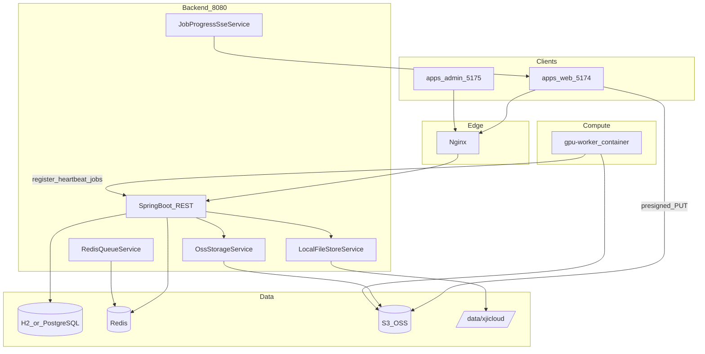

# XJICloud — Agent 上下文记忆文档

> 供 Cursor / 其他 AI Agent 快速理解本仓库的结构、已实现功能、扩展点与约束。  
> 用户面向文档见 [../README.md](../README.md)；部署见 [Deploy.md](Deploy.md)。

**最后更新：** 2026-07-29（企业级 monorepo：apps / services / packages / vendors）

---

## 1. 项目是什么

**XJICloud** 是一套 **3D Gaussian Splatting（3DGS）建模解决方案云平台**：

- 用户通过 Web 上传图片数据集 → 触发 GPU 算力容器训练（当前为 **mock 算法**）→ 下载产出模型（PLY）
- 用户上传 / 管理 **PLY/SPZ** 模型，用 **Spark 2.0** 查看标注，用 **SuperSplat** iframe 做高级编辑
- 管理员通过独立 **Vue Admin 面板** 配置 OSS、监控 Worker 与训练任务

技术栈：**Vue 3.5 + Vite + Pinia + pnpm workspace**（前端）、**Spring Boot 3.3 + Java 17**（后端）、**Redis**（任务队列）、**S3 兼容 OSS**（MinIO / 阿里云 OSS）、**Python GPU Worker 容器**（Alibaba Cloud Linux 3）、**Rust/WASM**（浏览器端 Spark）。

**桌面端（Electron/Tauri）已移除**，仅保留 Web。

---

## 2. 仓库结构（Monorepo）

```
XJICloud/
├── apps/web/                 # 用户前端 @xjicloud/web（:5174）
├── apps/admin/               # 管理前端 @xjicloud/admin（:5175，base /admin/）
├── packages/spark/           # Spark 2.0 TS 渲染库 @xjicloud/spark
├── packages/shared/          # 共享 ApiResponse / ApiError
├── services/backend/         # Spring Boot（:8080）
├── services/gpu-worker/      # Python Worker + Dockerfile
├── rust/                     # spark-rs、spark-worker-rs WASM
├── vendors/supersplat/       # SuperSplat 预编译静态资源
├── deploy/                   # Compose、Nginx、systemd、K8s
├── docs/                     # Deploy.md、本文件
├── scripts/                  # copy-supersplat-dist 等
├── package.json              # pnpm workspace 根编排
└── pnpm-workspace.yaml
```

---

## 3. 系统架构



### 3.1 双存储策略（重要）

| 数据类型 | 存储 | 服务类 |
|----------|------|--------|
| PLY/SPZ 模型、viewer.json | **本地磁盘** `{xjicloud.storage.root}` | `LocalFileStoreService` |
| 图片数据集、训练产出 model.ply | **OSS**（浏览器/Worker 直传） | `OssStorageService` |
| 元数据（用户、项目、任务、Worker） | **H2（dev）/ PostgreSQL（prod）** | JPA 实体 |

**不要**在未规划的情况下把 PLY/SPZ 模型迁移到 OSS，会破坏 Spark/SuperSplat 现有下载/Range 逻辑。

### 3.2 三套 JWT 身份

| 角色 | claim `type` | Filter | 用途 |
|------|--------------|--------|------|
| 用户 | `user` | `JwtAuthenticationFilter` | 普通云平台 API |
| 管理员 | `admin` | `AdminJwtAuthenticationFilter` | `/api/v1/admin/**` |
| Worker | `worker` | `WorkerJwtAuthenticationFilter` | `/api/v1/worker/**`（register 除外） |

Worker 注册额外需要请求头：`X-Worker-Secret`，与 `xjicloud.worker.shared-secret` 一致。

---

## 4. 训练流水线（图片 → 模型）

用户侧「数据上传」主流程：上传**含有建模素材的图片文件夹**，浏览器端归档后直传 OSS，再入队由 GPU 算力容器处理。

**「归档打包」含义（重要）：**
- **不是** zip/tar 压缩包
- **是** 浏览器端逻辑归档：`datasetArchive.ts` 过滤 JPG/PNG/WebP → 按 `webkitRelativePath` 排序 → 4 位序列重命名（`0001.jpg`…）→ 生成 `manifest.json` → 逐文件 presigned PUT 到 OSS

```
1. 用户选择文件夹（webkitdirectory，须先打开项目）
   → src/utils/datasetArchive.ts 过滤 jpg/png/webp，重命名为 0001.jpg…
   → 生成 manifest.json（version/imageCount/files[]：archivedName、originalName、contentType、sizeBytes）

2. POST /api/v1/projects/{id}/datasets
   → 后端创建 TrainingJob(status=UPLOADING)，返回 presigned PUT URL 列表

3. 浏览器直传 OSS（src/api/datasets.ts putToOss，XHR 进度）
   → datasets/{jobId}/images/{archivedName} + datasets/{jobId}/manifest.json

4. POST /api/v1/projects/{id}/datasets/{jobId}/complete
   → status=QUEUED，RPUSH 写入 Redis 队列 xjicloud:jobs

5. gpu-worker poll GET /api/v1/worker/jobs/next
   → presigned GET 下载图片 → mock_trainer.py 分阶段上报进度
   → presigned PUT output.ply 至 OSS → POST .../complete

6. 用户 GET /api/v1/jobs/{id}/events（SSE）实时看进度
   → COMPLETED 后 GET /api/v1/jobs/{id} 拿 presigned 下载 URL
```

**与 PLY/SPZ 模型上传的区别：** 图片数据集走 OSS + 训练队列；PLY/SPZ 走 `/projects/{id}/models/upload` 存本地盘，供查看器加载，**不是**训练输入。

**Job 状态枚举：** `PENDING | UPLOADING | QUEUED | RUNNING | COMPLETED | FAILED | CANCELLED`

---

## 5. 后端包结构（`com.xjicloud.*`）

| 包 | 职责 |
|----|------|
| `auth/` | 用户注册登录、JWT |
| `project/` | 工程项目 CRUD |
| `model/` | PLY/SPZ 本地上传下载、viewer-config、export |
| `job/` | 训练任务、数据集 API、`TrainingJobService` |
| `worker/` | Worker 节点注册、心跳、领任务、进度 |
| `admin/` | 管理员账户、Admin API |
| `oss/` | S3 兼容存储、presigned URL、DB 热更新配置 |
| `queue/` | Redis 列表队列 |
| `sse/` | `JobProgressSseService`（SseEmitter） |
| `config/` | Security、Redis、各 Properties |

**入口：** `services/backend/src/main/java/com/xjicloud/XjiCloudApplication.java`（`@EnableScheduling`）

**配置：** `services/backend/src/main/resources/application.yml`  
关键前缀：`xjicloud.jwt` / `storage` / `oss` / `worker` / `admin` / `cors`

**OSS 运行时配置：** 默认读 yml，管理员可通过 Admin API 写入 `system_config` 表并 `reloadClients()`。

---

## 6. REST API 速查

前缀 `/api/v1`。统一响应：`{ success, message, data }`。

### 6.1 用户（Bearer 用户 JWT）

| 方法 | 路径 | 说明 |
|------|------|------|
| POST | `/auth/register`, `/auth/login` | 公开 |
| GET/POST | `/projects` | 项目 |
| GET | `/projects/{id}/models` | 模型列表 |
| POST | `/projects/{id}/models/upload` | multipart PLY/SPZ → 本地盘 |
| POST | `/models/{id}/download-token` | SuperSplat 短期下载 token |
| GET | `/models/{id}/download` | 下载（Bearer 或 `?access_token=`，支持 Range） |
| GET/PUT | `/models/{id}/viewer-config` | 查看器 JSON v2 |
| POST | `/models/{id}/export` | 上传导出 SPZ/PLY |
| POST | `/projects/{id}/datasets` | 创建数据集任务 + presigned URLs |
| POST | `/projects/{id}/datasets/{jobId}/complete` | 确认上传完成并入队 |
| GET | `/projects/{id}/jobs` | 项目训练任务列表 |
| GET | `/jobs/{id}` | 任务详情 |
| GET | `/jobs/{id}/events` | **SSE** 进度（需 Authorization，前端用 fetch 流式读） |

### 6.2 Worker（Bearer worker JWT + 注册时 X-Worker-Secret）

| 方法 | 路径 |
|------|------|
| POST | `/worker/register` |
| POST | `/worker/heartbeat` |
| GET | `/worker/jobs/next` | 长轮询（默认 25s） |
| POST | `/worker/jobs/{id}/progress` |
| POST | `/worker/jobs/{id}/complete` |
| POST | `/worker/jobs/{id}/fail` |

### 6.3 Admin（Bearer admin JWT）

| 方法 | 路径 |
|------|------|
| POST | `/admin/auth/login` | 公开 |
| GET | `/admin/dashboard` |
| GET/PUT | `/admin/oss` |
| POST | `/admin/oss/test` |
| GET | `/admin/workers` |
| POST | `/admin/workers/{id}/offline` |
| GET | `/admin/jobs` |
| POST | `/admin/jobs/{id}/retry`, `/cancel` |
| GET | `/admin/stats` |

**默认管理员：** `admin` / `admin123`（`AdminDataInitializer` 首次启动创建，生产必改）

---

## 7. 用户前端（`apps/web/`）

包名 `@xjicloud/web`。业务源码在 `apps/web/src/`；渲染库通过 `@xjicloud/spark`（`packages/spark`）。

路由与组件见 `apps/web/src/router`；训练流见 `DatasetUploadPanel` / `TrainingJobPanel` / `api/datasets.ts`。

## 8. 管理面板（`apps/admin/`）

- `base: /admin/`，端口 5175，包名 `@xjicloud/admin`
- 共用 `@xjicloud/shared`；构建：`pnpm build:admin`

## 9. GPU Worker（`services/gpu-worker/`）

`worker_agent.py` + `mock_trainer.py`；Docker 构建上下文为 `services/gpu-worker/`。

## 10. 本地开发

```bash
pnpm install

cd services/backend && mvn spring-boot:run

pnpm dev:web
pnpm dev:admin
docker build -t xjicloud/gpu-worker services/gpu-worker/
```

部署见 [Deploy.md](Deploy.md)；compose 上下文为 `services/backend`、`services/gpu-worker`。

## 11. 已知限制

1. SuperSplat：使用 `vendors/supersplat` 预编译资源；web `predev`/`prebuild` 自动复制到 `public/supersplat`
2. OSS CORS / 用户 PC 网段防火墙（Deploy.md §5.1.5）
3. SSE 需 Nginx `proxy_buffering off`
4. Worker 密钥须与后端一致
5. 训练仍为 mock

## 12. Agent 约定

- 不改 `packages/spark/`、`rust/`（除非任务要求）
- 用户前端改 `apps/web`；管理端改 `apps/admin`；后端改 `services/backend`
- 关键配置：`services/backend/src/main/resources/application.yml`、`pnpm-workspace.yaml`、`apps/*/vite.config.ts`

## 13. 实体与 Redis

JPA：`users`, `projects`, `model_assets`, `viewer_configs`, `training_jobs`, `dataset_assets`, `worker_nodes`, `admin_users`, `system_config`

Redis 列表：`xjicloud:jobs`

OSS：`datasets/{jobId}/images/`、`outputs/{jobId}/model.ply`

---

*重大架构变更后请同步更新本文与根 README。*
