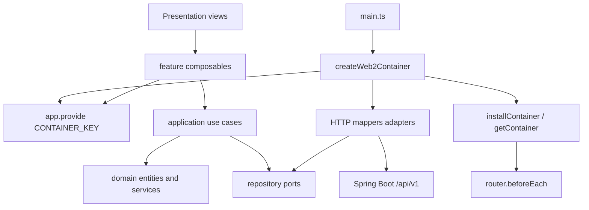

# web2 前端架构（DDD）

> 给开发者与 AI Agent 的 **当前用户前端知识库**。包级入门见 [apps/web2/README.md](../apps/web2/README.md)；改代码时的硬规则见 [apps/web2/AGENTS.md](../apps/web2/AGENTS.md)。  
> 全仓后端 / Worker / 部署仍以 [AGENT_CONTEXT.md](./AGENT_CONTEXT.md) 为准。工程规则、验证与 Code Review 以 [TEAM_ENGINEERING.md](./TEAM_ENGINEERING.md) 为准。  
> **最后更新：** 2026-08-31

本文记录的是 **已经落地的** 结构，不是愿景。**`apps/web2` 是当前用户产品面**；`apps/web` 已弃用。同一套 `/api/v1` 后端。UI 为浅色壳 + 暗画布，不是旧版暗色 Twilight Amber。

---

## 1. 一句话

web2 把「数据生产、用例编排、视图消费」拆开：Domain 不依赖框架；Infrastructure 把 `/api/v1` 与浏览器 API 翻译成实体；Presentation 只渲染用例结果。

前端 DDD **不是** 把后端微服务目录抄进 Vue。它解决的是 view 里同时出现 `fetch`、字段换算、权限判断、Pinia 杂物抽屉的问题。

---

## 2. 设计原则

1. **依赖向内**：Presentation → Application → Domain。Infrastructure 实现 Domain 的 port。Domain 不知道 HTTP、Vue、localStorage。
2. **限界上下文（BC）按业务能力切**，不按页面切。一个页面可以组合多个 BC 的 composable。
3. **防腐层（ACL）在 mapper**：后端 `snake_case`、`state` 魔法数、`records` 列表键只出现在 `infrastructure/mappers`。
4. **用例是剧本**：`loginUseCase`、`submitDatasetUseCase`、`openEditorUseCase` 这类扁平函数，便于单测。
5. **Result 不抛进 UI**：`Result<T> = readonly [error, data]`。错误码在 `DomainError`，文案在 i18n `errors.*`。
6. **组合根唯一**：`createWeb2Container()` 是唯一 `new` 仓库实现的地方。
7. **够用就停**：不要为登录页再拆 12 层。新规则先放领域服务；只有跨实体或跨端口时才加用例。

通用方法论见 `.agents/skills/frontend-ddd/SKILL.md`。冲突时以 **本仓库 web2 目录与测试** 为准。

---

## 3. 运行时与组合根



启动顺序（`src/main.ts`）：

1. `createWeb2Container()` 注入 `localStorage`、`fetch`、各 HTTP 仓库、JobWatchHub、EditorBridge。
2. `installContainer(container)` 给路由守卫。
3. `app.provide(CONTAINER_KEY, container)` 给 composable 的 `inject`。
4. 挂 i18n、router、样式。

401 时 HTTP 客户端调用 `unauthorized.notifyUnauthorized()`：清 session、清 workspace、清 job watch。不要在页面里再写一套登出副作用。

测试可传入假 `storage` / `fetchImpl` / `baseUrl` 构造容器，不必起 Vite。

---

## 4. 目录与层

```text
apps/web2/src/
├── main.ts
├── app/                 # 组合根、路由、i18n（不是 Domain）
├── shared/              # 跨 BC 内核：Result、DomainError、HTTP、架构测试
├── features/<bc>/
│   ├── domain/
│   │   ├── entities/
│   │   ├── services/          # 纯函数不变量
│   │   └── repositories/      # 接口 only，文件名 *.repository.ts 或 *.port.ts
│   ├── application/
│   │   └── use-cases/
│   ├── infrastructure/
│   │   ├── mappers/
│   │   ├── repositories/
│   │   └── adapters/
│   └── presentation/
│       ├── composables/
│       └── *.vue
└── presentation/        # 壳：CloudLayout、AppButton、styles、errors
```

`src/presentation` **不是** 第六个 BC。它只放跨页面的视觉与 `formatDomainError`。Help 页没有独立领域，可以放在这里。

Vite 别名 `@` → `src/`。**Vue 单文件里不要用** `../../domain`：从 `presentation/*.vue` 出发会指到 `features/` 而不是该 BC 的 domain。

Vitest 配置与 Vite 配置分离（`vitest.config.ts`），避免 plugin 类型冲突。

---

## 5. 共享内核（`src/shared`）

| 模块 | 作用 |
|------|------|
| `result.ts` | `ok` / `err` / `isOk` |
| `domain-error.ts` | `DomainErrorCode` 联合类型 + `DomainError` |
| `di.ts` | `CONTAINER_KEY` |
| `infrastructure/http-client.ts` | Bearer、JSON/blob、`downloadBytes` 进度、映射 `ApiError` |
| `unwrap.ts`（presentation） | 仅 UI 需要把 Result 摊开时用，不要在 domain 用 |
| `architecture.spec.ts` | 依赖方向门禁 |
| `parity.spec.ts` | 与旧站能力对应的用例文件必须存在 |

HTTP 客户端属于 **shared infrastructure**，不是某个 BC 的领域。各 BC 的 `http-*.repository.ts` 只依赖 `HttpClient` 接口，不直接 `fetch`。

当前错误码（改码时同步 `src/app/i18n/index.ts` 的 `errors.*`）：

`AUTH_*`、`DATASET_*`、`JOB_*`、`PROJECT_*`、`MODEL_*`、`VIEWER_CONFIG_INVALID`、`EDITOR_*`、`OSS_UPLOAD_FAILED`、`SSE_CONNECT_FAILED`、`NETWORK`、`UNKNOWN`。

---

## 6. 限界上下文

跨 BC 规则：A 的 presentation 可以调用 B 的 **composable**（同一页面组合）。A 的 domain **禁止** import B 的 infrastructure。需要 B 的能力时，在组合根把 B 的 port 注入，或在 Application 显式传入 deps。

### 6.1 Identity（身份）

| | |
|--|--|
| UL | UserSession、Captcha、登录/注册 |
| 实体 | `user-session.entity`、`captcha.entity` |
| 领域服务 | `captcha-policy.service`（登录是否强制验证码） |
| Ports | `AuthRepository`、`SessionStore` |
| 基础设施 | `http-auth.repository`、`local-storage-session.store` |
| 用例 | `loginUseCase`、`registerUseCase`、`resolveAuthNavigation` |
| UI | `LoginView`、`useAuthSession` |

会话在 localStorage。路由用 `isAuthenticated(session)` + `resolveAuthNavigation`，不要在每个页面手写 if。

### 6.2 Project（工程）

| | |
|--|--|
| UL | Project、最近打开 |
| 实体 | `project.entity`（id/name/description/createdAt） |
| 领域服务 | `recent-projects.service`（上限 `MAX_RECENT_PROJECTS`） |
| Ports | `ProjectRepository`、`WorkspacePersistence`（当前工程 id、最近列表） |
| UI | `HomeView`、`ProjectListView`、`useProjectWorkspace` |

「当前工程」是 workspace 持久化，不是后端字段。查看器、上传、编辑器都读 `activeProjectId()`。

### 6.3 Dataset-training（数据集与训练）

| | |
|--|--|
| UL | TrainingJob、归档图片、manifest、SSE |
| 实体 | `training-job.entity` |
| 领域服务 | `dataset-archive.service`（过滤 jpg/png/webp、四位序号、manifest）、`job-policy.service`（能否取消/删除）、`sse-buffer.service` |
| Ports | `TrainingJobRepository`、`JobEventPort`、`ObjectStoragePort` |
| 应用 | `submit-dataset.usecase`、`job-watch-hub`（进程内订阅，401 时清空） |
| 适配器 | `xhr-object-storage`（OSS presigned PUT 进度）、`fetch-job-event`（SSE，不能走普通 JSON client） |
| UI | `UploadView`、`DatasetUploadPanel`、`TrainingJobPanel`、`useDatasetTraining` |

归档 **不是** zip。与全仓 AGENT_CONTEXT 第 4 节同一条流水线。PLY 上传不属于本 BC。

### 6.4 Model-asset（模型资产）

| | |
|--|--|
| UL | ModelAsset、PLY/SPZ、下载 token、export、分片上传会话 |
| 领域服务 | `model-format.service`（格式与 2GB 上限）、`chunk-range.service` |
| Port | `ModelAssetRepository`（session / chunk / complete / delete） |
| 用例 | `listModelsUseCase`、`uploadModelUseCase`（顺序分片续传）、`deleteModelUseCase` |
| UI | `useModelAssets`（工程列表、上传页、查看器、编辑器共用） |

没有工程 id 时 `MODEL_PROJECT_REQUIRED`。非法扩展名 `MODEL_INVALID_FORMAT`。超过 2GB `MODEL_TOO_LARGE`。

### 6.5 Viewer（查看）

| | |
|--|--|
| UL | ViewerConfig v2、defaultView、模型摘要 |
| 实体 | `viewer-config.entity`（仍包含标注/立方体类型，供配置解析；**当前产品页不提供绘制 UI**） |
| 领域服务 | `parseViewerConfig` / 空配置 |
| Port | `ViewerStoragePort`（列表、字节、config、export） |
| UI | `LayerViewerView`、`NativeSplatViewport`、`useViewerStorage` |

画布是 **web2 原生** Three + `@xjicloud/spark`（`SplatMesh` + `SparkRenderer` + `SparkControls`）。父组件下载 `File` 再传入，画布不 inject 存储。

保留：打开工程模型、上传 PLY/SPZ、轨道/平移/缩放、重置视角、底栏相机读数、若存在则应用 `defaultView`。  
不保留：涂抹、擦除、气泡、立方体、查看器内导出。高级编辑在 Editor BC。

相机状态：`CloudLayout` **provide** `CAMERA_STATUS_KEY`，查看器 **inject** 后写入。子组件 provide 到不了父布局。

### 6.6 Editor（高级编辑）

| | |
|--|--|
| UL | EditorLaunch、空白会话、云端模型、本地文件、iframe dirty |
| 实体 | `EditorLaunchParams`（`signedUrl` / `fileName` / `modelId` 均可选） |
| 领域服务 | `createBlankEditorLaunch`、`createRemoteEditorLaunch`、`hasRemoteScene` |
| Port | `EditorBridgePort`（`buildSrc`、`isDirty`、`exportPly`） |
| 协议 | `supersplat-protocol.ts`（postMessage 常量、`buildSuperSplatSrc`） |
| 用例 | `openEditorUseCase`（下载 token）、`prepareLocalEditorLaunch`、`blankEditorLaunch`、`saveEditorExportUseCase` |
| UI | `SuperSplatEditorView`、`useEditorSession` |

无云端模型、无当前工程都可以进入 `/app/supersplat`。空白 iframe：`/supersplat/index.html?embedded=1` 且 **没有** `load=`。本地打开：校验格式后 `blob:` URL 作为 `load`。云端保存仅当 iframe 带回的 `modelId` 与当前云端会话一致。

---

## 7. 数据流（强制方向）

```text
View 事件
  → composable
    → use case(deps from container)
      → domain 不变量
      → port
        → mapper ← DTO
        → HttpClient / XHR / SSE / postMessage
```

**反例（禁止）：**

- `.vue` 里 `fetch('/api/v1/...')`
- 模板里 `price * 0.9`、列表 `dto.records.map`
- domain 文件 `import { ref } from 'vue'`
- composable `import { mapJobFromDto }`
- 在 `LayerViewerView` 里解析 viewer-config JSON 字段

**正例（登录）：**

```text
LoginView
  → useAuthSession().login(input)
    → loginUseCase({ auth, session }, input)
      → assertCaptchaForMode
      → AuthRepository.login
      → SessionStore.persist
    → Result<UserSession>
  → formatDomainError
```

---

## 8. Presentation 约定

- Composable 只暴露：命令函数 + 给模板的只读状态。不要把 repository 漏出给模板。
- 跨 BC 页面（查看器同时要工程、模型、配置）分别 `useProjectWorkspace` / `useModelAssets` / `useViewerStorage`。
- 壳组件：`AppButton`（primary | ghost | destructive）、`AppSheet`、`AppToast`、`ToolIcon`。
- 样式：`shell.css` 产品壳；`viewer-canvas.css` 画布 + 查看器浮动检查器。
- 动效：`presentation/motion.ts`（`bounce: 0` 默认，手势动量才用轻微 bounce）。尊重 `prefers-reduced-motion` / `prefers-reduced-transparency`。

---

## 9. 测试金字塔（web2）

| 层 | 现有重点 |
|----|----------|
| Domain | captcha、归档、job policy、模型格式、viewer-config、最近工程、editor launch |
| Application | auth、project、submit-dataset、editor open/export/local |
| Shared | HTTP 客户端、mapper 快照、architecture、parity |
| Presentation | 不强制 `@vue/test-utils`；回归靠 `build:web2` + 手工主路径 |
| E2E | 未内置 Playwright；需要登录的流依赖 :8080 |

加不变量时优先写 **domain spec**，不要先堆 E2E。

`architecture.spec.ts` 只扫 `.ts`。Vue 里的违规要靠 review / AGENTS 规则抓住。

---

## 10. 与已弃用的 apps/web、后端的关系

- **`apps/web` 已弃用。** 新功能只进 web2。旧包可作行为对照，不要双写。
- API 契约、JWT、SSE、OSS 直传、本地盘模型：与旧版相同，见 AGENT_CONTEXT §3–§6。
- SuperSplat 静态资源：`vendors/supersplat` → `apps/web2/public/supersplat`（旧版 web 仍可复制一份）。
- Spark：`@xjicloud/spark` workspace 包。web2 查看器只使用渲染与 `SparkControls`，不把 Spark 当成领域 port。
- 功能对齐靠 `parity.spec.ts` 的用例文件清单，不是靠复制 Vue。

---

## 11. 演进时怎么改

1. 点名 BC 与用例（谁、做什么、成功长什么样）。
2. 不变量放 domain service，并补 spec。
3. 新外部形状 → mapper，禁止 DTO 进入 presentation。
4. 在 `container.types.ts` + `create-container.ts` 接上实现。
5. composable 只多一层函数，不把 XHR 细节写进 Vue。
6. `pnpm test:web2` && `pnpm build:web2`。
7. 若新增用户能力，把用例路径加入 `parity.spec.ts`。
8. 架构级变更同步本文日期与根 README / AGENT_CONTEXT 中的 web2 段落。

**不要**为了「更 DDD」把 `NativeSplatViewport` 做成 Domain。WebGL 是 Presentation + 引擎适配，下载与配置才走 Viewer port。

---

## 12. 已知产品事实（避免 Agent 回退）

- **默认开发入口是 `apps/web2` :5176**（根目录 `pnpm dev`）。
- 旧版 `apps/web` :5174 已弃用，仅 `pnpm dev:web-legacy`。
- web2 `strictPort: true`。
- 查看器已删除厚 `SparkViewport` 与 throwing storage adapter。
- 高级编辑不再用「无模型空状态」挡住 iframe。
- Phosphor 图标必须 `Ph*` 导出，否则生产构建失败。
- 验证码接口无后端即登录不可用，不要把代理失败当成前端回归。
